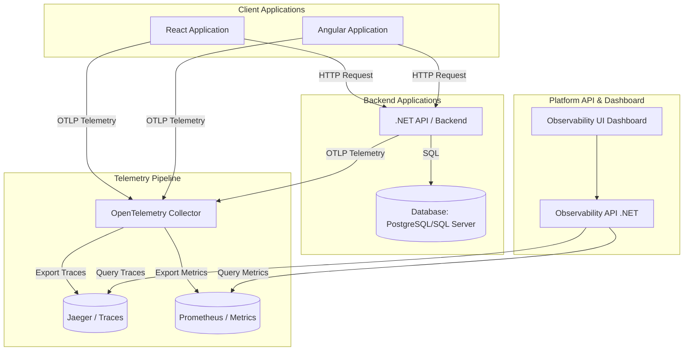
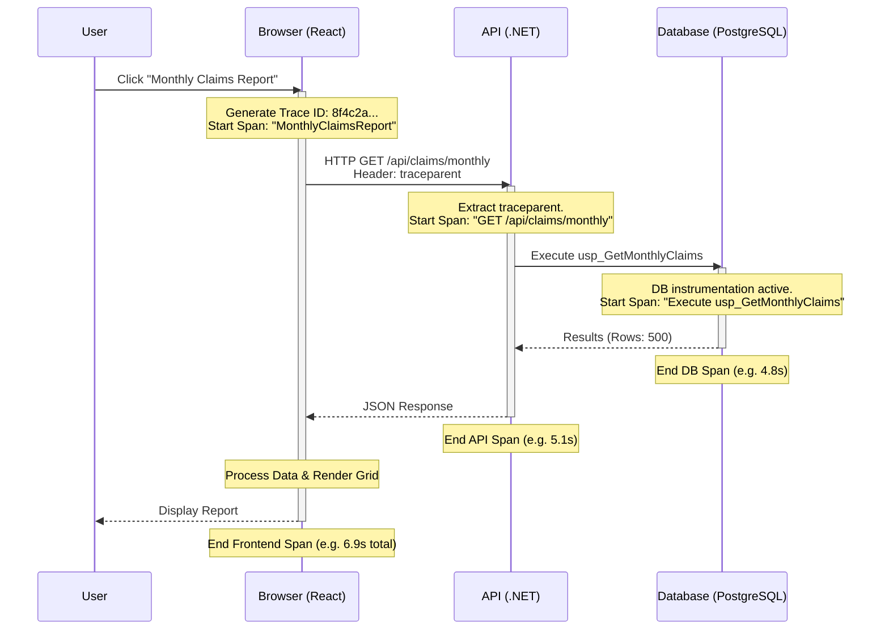
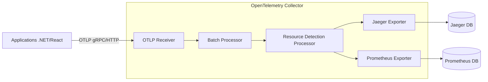

# Platform Architecture

This document describes the high-level architecture and telemetry flow of the Enterprise Application Observability Platform.

## 1. Overall Architecture

## 2. Trace Lifecycle (Frontend to Database)

## 3. Telemetry Ingestion and Routing

